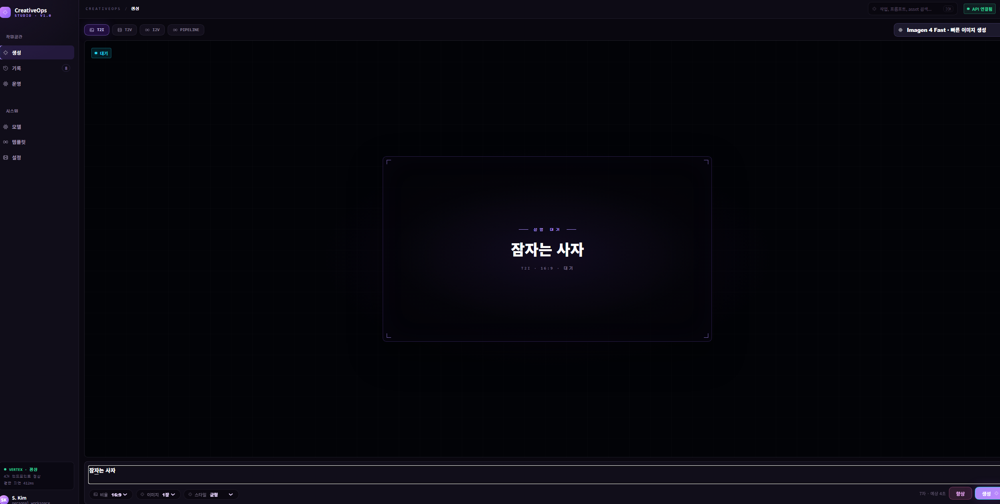
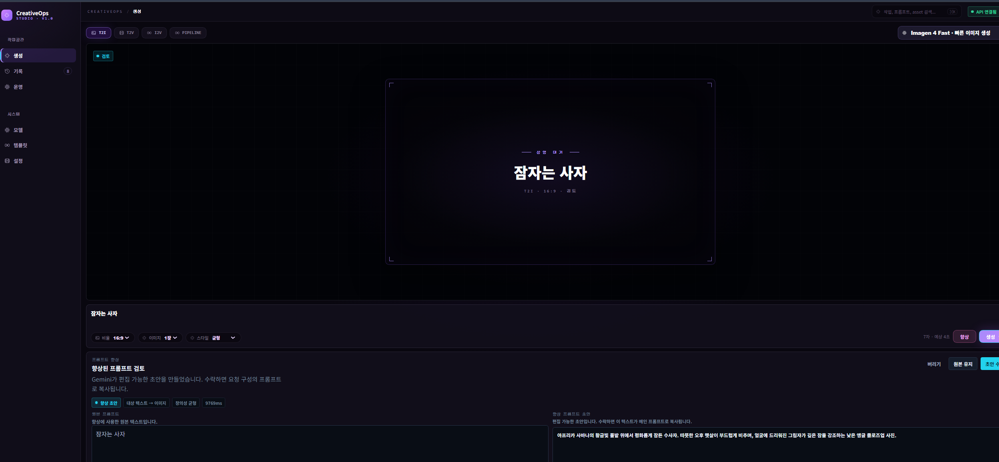
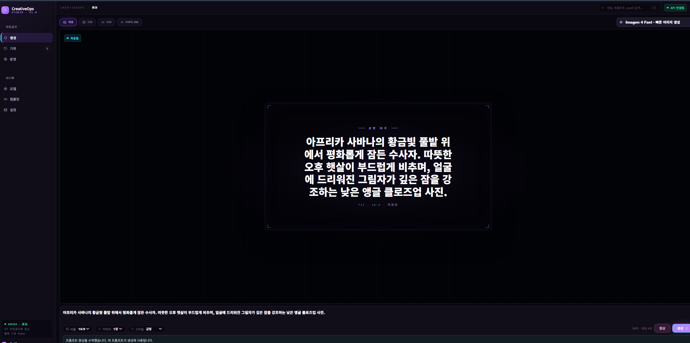
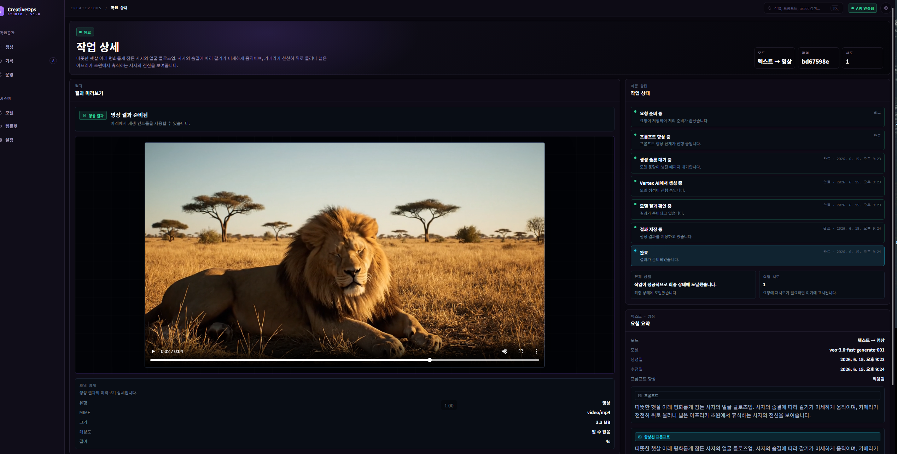

# CreativeOps Studio

CreativeOps Studio는 Gemini, Imagen, Veo 기반 생성 경험을 Kubernetes에서 안전하게
운영하기 위한 개인용 멀티모달 AI 플랫폼입니다. 사용자는 프롬프트를 검토한 뒤 이미지와
영상을 생성하고, 운영자는 durable job, provider failure, queue, rollout과 SLO를 추적할
수 있습니다.

이 프로젝트의 핵심은 AI API 호출 자체보다 비용과 실패가 있는 장시간 생성 작업을
PostgreSQL source of truth, transactional outbox, Redis/Celery worker, 좁은 provider
boundary로 운영하는 것입니다. GKE/Terraform, Workload Identity, 부하테스트, 관리형
Prometheus, digest release와 자동 rollback을 실제 운영 문제와 연결합니다.

포트폴리오에서는 이 end-to-end 경험을 `AI Full Stack Engineer`, `FDE`,
`AX Consultant`, `AI Platform Engineer` 관점으로 설명합니다. 사용자 workflow와 제품
구현, 현장 통합과 문제 해결, 도입 효과와 운영 절차, 배포·관측·복구 가능한 플랫폼을
서로 분리된 기능이 아니라 하나의 전달 과정으로 다룹니다.

## 운영 아키텍처

로그인 사용자에게는 개인 사용량 `/usage`, Master에게는 관리 콘솔 `/master`를 제공합니다.
Master는 플랜·보너스·사용자 정지와 Audit을 확인할 수 있으며, 검증은 로컬 mock 기준입니다.
[관리 운영 절차](docs/runbooks/master-operations.md)와
[G10 구현·검증 근거](docs/portfolio/issue-137-g10-closeout.md)를 참고하세요.

```text
React/Vite Studio
  -> FastAPI API
    -> PostgreSQL: jobs, state history, assets, prompt provenance, outbox
    -> transactional outbox
      -> dispatcher -> Redis/Celery -> worker
        -> mock provider or Vertex AI through google-genai
        -> GCS FUSE mounted DATA_DIR / local DATA_DIR

Operator surfaces
  -> /api/health and /api/health/live
  -> /api/ops/health and /api/ops/metrics
  -> /metrics -> GKE Managed Prometheus -> alerts, dashboard, SLO

Delivery
  -> CI/test -> Trivy/SBOM -> Cloud Build provenance
  -> Artifact Registry digest -> Terraform rollout -> health gate
  -> success or automatic digest rollback
```

프론트엔드는 Vertex AI나 credential을 직접 다루지 않습니다. API는 job과 outbox를 같은
DB transaction에 저장하고, dispatcher는 `job_id`만 큐에 발행합니다. Worker는 최신
job을 다시 읽고 [state machine](backend/app/state_machine.py)을 통해서만 상태를
변경합니다. 자세한 설계는 [Architecture](docs/architecture.md)와
[Job lifecycle](docs/job-lifecycle.md)에 있습니다.

## 플랫폼 신뢰성 설계

- **Durable dispatch:** Postgres job/outbox가 source of truth이며 Celery result state에
  사용자 상태를 맡기지 않습니다.
- **Failure-aware provider boundary:** 429, 5xx, timeout, malformed response를 안전한
  public error로 변환하고 bounded retry/backoff와 rate limit을 적용합니다.
- **Recoverable video work:** late ack, worker-lost rejection, prefetch `1`, resumable Veo
  polling으로 긴 작업의 중복·유실 위험을 제한합니다.
- **Safe Kubernetes rollout:** readiness/liveness, PDB, resource request/limit,
  multi-replica precondition과 health-gated rollback을 사용합니다.
- **Observable operation:** DB-backed job/outbox/backlog 상태와 Prometheus HTTP latency,
  error rate, provider failure code를 함께 노출합니다.
- **Supply-chain guard:** runtime image 취약점 차단, SPDX SBOM, provenance가 있는 build,
  digest-only release를 사용합니다.
- **Cost-safe validation:** 기본 검증은 deterministic mock provider로 실행하며 실제
  Vertex 요청은 별도의 승인, 요청 상한과 사용량 ledger를 요구합니다.

## 구현과 검증 수준

| Capability | Evidence level | 검증 근거 | 현재 상태 |
|---|---|---|---|
| Mock 생성·asset·정리 golden path | `Live Verified` | [Mock runbook](docs/runbooks/local-mock.md), [smoke workflow](.github/workflows/smoke-mock-golden-path.yml) | 로컬 기본 모드 |
| Postgres outbox와 Redis/Celery worker | `Live Verified` | [Job lifecycle](docs/job-lifecycle.md), [testing](docs/testing.md) | Compose/GKE 검증 |
| GKE, managed data, Workload Identity | `Live Verified` | [GCP Terraform](infra/gcp/README.md), [GKE runbook](docs/runbooks/gcp-gke.md) | 비용 관리 pause |
| HPA, node autoscaling, k6 | `Live Verified` | [k6 runbook](docs/runbooks/k6-gcp-load-test.md), [operation record](docs/current-work.md) | HPA off, node pool paused |
| Managed Prometheus, alerts, dashboard, SLO | `Live Verified` | [monitoring.tf](infra/gcp/monitoring.tf), [operation record](docs/current-work.md) | workload paused |
| Image scan, SBOM, digest rollout, rollback | `Live Verified` | [supply-chain workflow](.github/workflows/image-supply-chain.yml), [release script](scripts/deploy_gcp_release.sh) | CI 구현 유지 |
| Vertex provider boundary | `Live Verified` | [Vertex pilot runbook](docs/runbooks/prompt-enhancement-vertex-pilot.md), [provider modes](docs/provider-modes.md) | post-fix 유료 재검증 전 |
| Paired prompt evaluation | `Implemented` | [evaluation gate](docs/runbooks/prompt-enhancement-evaluation-gate.md), [evaluation package](evals/prompt_enhancement) | mock 검증 완료, post-fix live 미검증 |
| GPU node pool와 GPU telemetry | `Planned` | [Issue #89](https://github.com/bbungjun/AI_multimodal_platform/issues/89) | 미구현 |
| 분산학습 운영 | `Planned` | [Issue #89](https://github.com/bbungjun/AI_multimodal_platform/issues/89) | 범위 외, 미구현 |

`Live Verified`는 특정 날짜와 revision에서 실제 runtime으로 확인했다는 뜻이며 현재
상시 운영 중이라는 뜻은 아닙니다. 전체 판정 기준과 근거는
[Portfolio Evidence Index](docs/portfolio/README.md)에 있습니다.

## 대표 운영 증거

- **HPA 검증:** GKE mock 환경에서 k6 590 iterations, 1,770 HTTP requests, checks
  100%, HTTP failure rate 0%, request-duration p95 53 ms를 기록했습니다. HPA 제거 후
  health와 Terraform no-drift를 다시 확인했습니다.
- **Alert 검증:** 통제된 provider failure에서 20 requests, HTTP 5xx 3건, 5xx ratio
  15%, 동일 코드 provider failure 3건을 관측했습니다. 두 alert가 firing된 뒤 mock
  복구 후 resolved됐습니다.
- **자동 rollback:** 의도적으로 health 조건을 불일치시킨 candidate rollout에서 API,
  worker, dispatcher, frontend 네 workload가 이전 digest로 복구되고 readiness를
  회복했습니다.
- **Provider incident:** 실제 Vertex 파일럿에서 structured-response failure와 timeout을
  관측했습니다. 새 실행으로 덮지 않고 prompt-free ledger와 failed manifest를 보존한 뒤
  No-Go로 중단하고 contract repair를 구현했습니다.

현재 AWS 포트폴리오 stack은 검증 후 제거된 `Destroyed` 상태이고, 개인 GCP stack은
비용 관리를 위해 workload replica와 node pool을 0으로 둔 `Paused` 상태입니다. GPU
node pool과 분산학습은 실제 구현 전이므로 완료 경험으로 주장하지 않습니다.

## 실제 생성 흐름

배포 서버에서 `잠자는 사자`를 입력한 뒤, 프롬프트 향상, 향상 프롬프트 적용, 동영상 생성까지 이어지는 화면입니다.

1. 대기 화면 및 `잠자는 사자` 입력



2. 프롬프트 향상 검토



3. 향상 프롬프트 적용



4. 동영상 생성 결과



지원 기능:

- Imagen text-to-image 생성
- Veo text-to-video 생성
- Veo image-to-video 생성
- Gemini 기반 prompt enhancement 초안 생성
- T2I -> I2V 파이프라인 job
- job history, 상세 timeline, 생성 asset preview, provider readiness 확인

## 기술 스택

- Backend: Python 3.11, FastAPI, SQLAlchemy async, asyncpg
- Database: PostgreSQL 16
- Frontend: Vite, React, TypeScript, TanStack Query
- AI SDK: `google-genai`
- Runtime: Docker Compose, Redis/Celery dispatch, local Postgres volume, local asset volume

## 빠른 시작: Mock Mode

Mock mode는 로컬 개발의 기본 권장 모드입니다. Google credential이 필요 없고 Gemini, Imagen, Veo를 실제 호출하지 않습니다.

1. 예시 파일로 `.env`를 만듭니다.

```powershell
Copy-Item .env.example .env
```

2. `.env`에서 아래 값을 유지하거나 설정합니다.

```env
AI_PROVIDER=mock
POSTGRES_USER=app
POSTGRES_PASSWORD=changeme
POSTGRES_DB=multimodal
GCP_PROJECT_ID=
GCP_LOCATION=us-central1
ENHANCE_MODEL=gemini-2.5-flash
DATA_DIR=/data/assets
JOB_RUNNER_CONCURRENCY=10
JOB_RUNNER_AUTO_START=false
JOB_DISPATCH_MODE=celery
CELERY_BROKER_URL=redis://redis:6379/0
CELERY_DEFAULT_QUEUE=generation
RATE_LIMIT_IMAGEN_PER_MIN=5
RATE_LIMIT_VEO_PER_MIN=1
RATE_LIMIT_GEMINI_PER_MIN=10
PROVIDER_RETRY_MAX_ATTEMPTS=3
PROVIDER_RETRY_BASE_DELAY_SEC=1.0
PROVIDER_RETRY_MAX_DELAY_SEC=20.0
CELERY_WORKER_CONCURRENCY=2
CELERY_WORKER_HEALTHCHECK_TIMEOUT_SEC=5
CELERY_WORKER_SHUTDOWN_GRACE_SEC=60
CELERY_TASK_ACKS_LATE=true
CELERY_TASK_REJECT_ON_WORKER_LOST=true
CELERY_WORKER_PREFETCH_MULTIPLIER=1
OUTBOX_DISPATCHER_BATCH_SIZE=50
OUTBOX_DISPATCHER_POLL_INTERVAL_SEC=1.0
OUTBOX_DISPATCHER_MAX_ATTEMPTS=10
VITE_API_BASE=
VITE_API_PROXY_TARGET=http://backend:8000
VITE_ALLOWED_HOSTS=localhost,127.0.0.1
```

Mock mode에서는 credential 관련 값을 비워둘 수 있습니다.

3. 로컬 환경을 확인합니다. 이 명령은 `.env`가 없으면 `.env.example`에서 만들고,
   기존 `.env`는 덮어쓰지 않습니다.

```powershell
.\scripts\setup_local.ps1
```

4. stack을 실행합니다.

```powershell
docker compose up -d --build
```

5. 앱을 엽니다.

- Frontend: <http://127.0.0.1:5173>
- Backend API docs: <http://127.0.0.1:8000/docs>
- Health: <http://127.0.0.1:8000/api/health>

## Vertex Mode

Vertex mode는 실제 provider 요청을 보내며 비용이 발생할 수 있습니다. Gemini, Imagen, Veo live check를 의도적으로 실행할 때만 사용합니다.

필수 설정:

```env
AI_PROVIDER=vertex
GCP_PROJECT_ID=your-gcp-project-id
GCP_LOCATION=us-central1
ENHANCE_MODEL=gemini-2.5-flash
```

Docker에서 ADC 또는 credential 파일을 쓰려면 host credential 경로와 container 경로를 함께 설정합니다.

```env
GOOGLE_APPLICATION_CREDENTIALS=/secrets/google-credentials.json
GOOGLE_APPLICATION_CREDENTIALS_HOST=/absolute/path/to/google-credentials.json
```

Service account 파일을 사용할 때도 같은 패턴을 사용합니다. credential JSON 내용은 `.env`, 문서, 로그, 커밋에 붙여 넣지 않습니다.

Health readiness는 provider 설정 가능 여부를 확인합니다. 모델 품질, quota, billing, live generation 성공을 보장하지는 않습니다.

```powershell
docker compose -f docker-compose.yml -f docker-compose.vertex.yml up -d --build
Invoke-RestMethod -Uri "http://127.0.0.1:8000/api/health"
```

비용이 발생할 수 있는 generation 요청을 보내기 전에는 [Vertex live QA runbook](docs/runbooks/vertex-live-qa.md)을 먼저 확인합니다.

## API

| Method | Path | Purpose |
|---|---|---|
| GET | `/api/health` | DB 및 provider readiness 확인 |
| POST | `/api/prompts/enhance` | 편집 가능한 prompt enhancement 초안 생성 |
| POST | `/api/generations` | T2I, T2V, I2V generation job 생성 |
| GET | `/api/generations` | 필터 기반 job history 조회 |
| GET | `/api/generations/{job_id}` | asset과 state history를 포함한 단일 job 조회 |
| DELETE | `/api/generations/{job_id}` | terminal job 및 local asset 삭제 |
| POST | `/api/pipelines` | T2I parent와 blocked I2V child 생성 |
| GET | `/api/pipelines/{parent_job_id}` | parent/child pipeline 조회 |
| GET | `/api/assets/{asset_id}` | asset metadata 조회 |
| GET | `/files/{job_uuid}/{filename}` | 검증된 local media file streaming |

## 개발 검증

Backend:

```powershell
cd backend
$env:AI_PROVIDER = "mock"
python -m pytest
```

Frontend:

```powershell
cd frontend
npm install
npm run build
```

Compose:

```powershell
docker compose config
```

## 문서

- [Architecture](docs/architecture.md)
- [Portfolio evidence](docs/portfolio/README.md)
- [Provider modes](docs/provider-modes.md)
- [Job lifecycle](docs/job-lifecycle.md)
- [Storage and assets](docs/storage-and-assets.md)
- [Testing strategy](docs/testing.md)
- [Local mock runbook](docs/runbooks/local-mock.md)
- [Vertex live QA runbook](docs/runbooks/vertex-live-qa.md)
- [Troubleshooting notes](docs/troubleshooting.md)
- [Architecture decision records](docs/adr)

## 안전 규칙

- `.env`, credential JSON, 생성 media, runtime log를 커밋하지 않습니다.
- 자동화 테스트는 mock 또는 fake provider를 사용합니다.
- Vertex live QA는 명시적이고 수동적이며 비용을 인지한 상태에서만 실행합니다.
- 현재 private repo의 git history에는 archived legacy context가 남아 있습니다. portfolio/public repo로 공개하려면 clean public history를 따로 만드는 것이 안전합니다.

## Mock Golden-Path Smoke

Run the backend HTTP golden path in mock mode only:

```powershell
python scripts/smoke_mock_golden_path.py --compose --env-file .env.example --timeout-sec 90
```

If `db`, `redis`, `backend`, `dispatcher`, and `worker` are already running:

```powershell
python scripts/smoke_mock_golden_path.py --base-url http://127.0.0.1:8000
```

The smoke refuses `--env-file .env`, requires `AI_PROVIDER=mock`, starts the
redis, dispatcher, and worker services when `--compose` is used, and verifies health,
prompt enhancement, T2I generation, job state history, PNG asset serving,
byte-range streaming, and cleanup. In mock mode, `vertex_charged: true` only
means the mock provider handler completed; it is not real Vertex billing.
