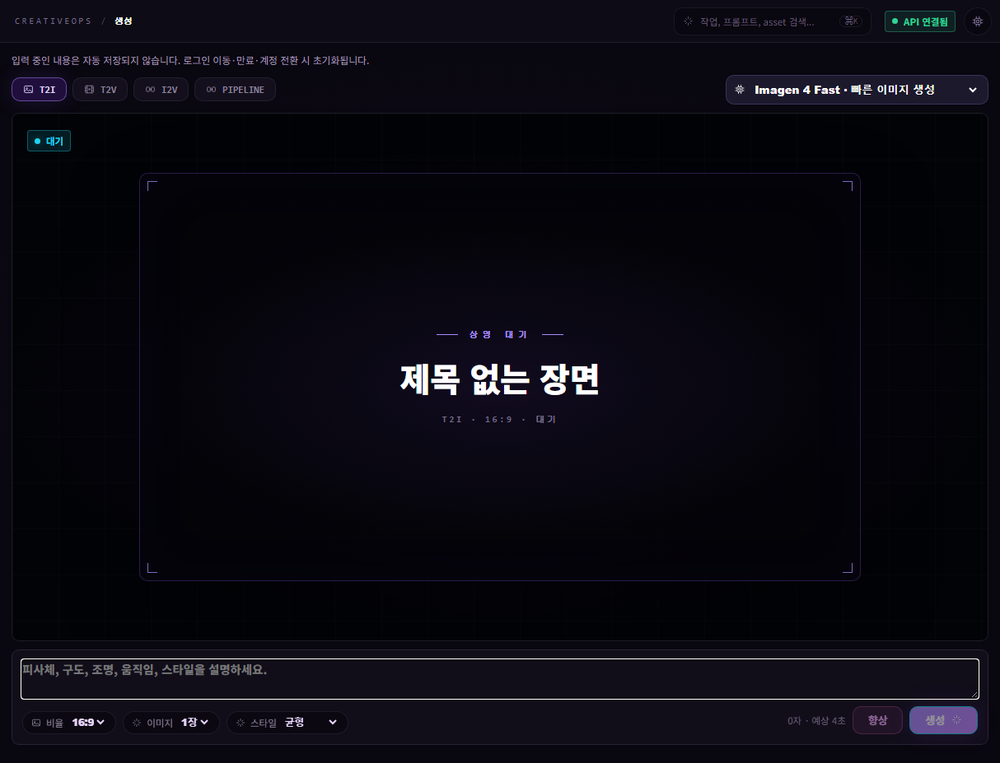
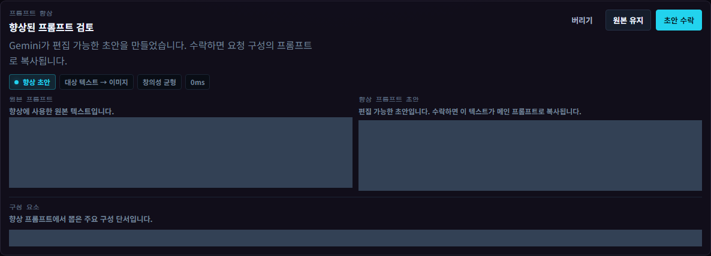
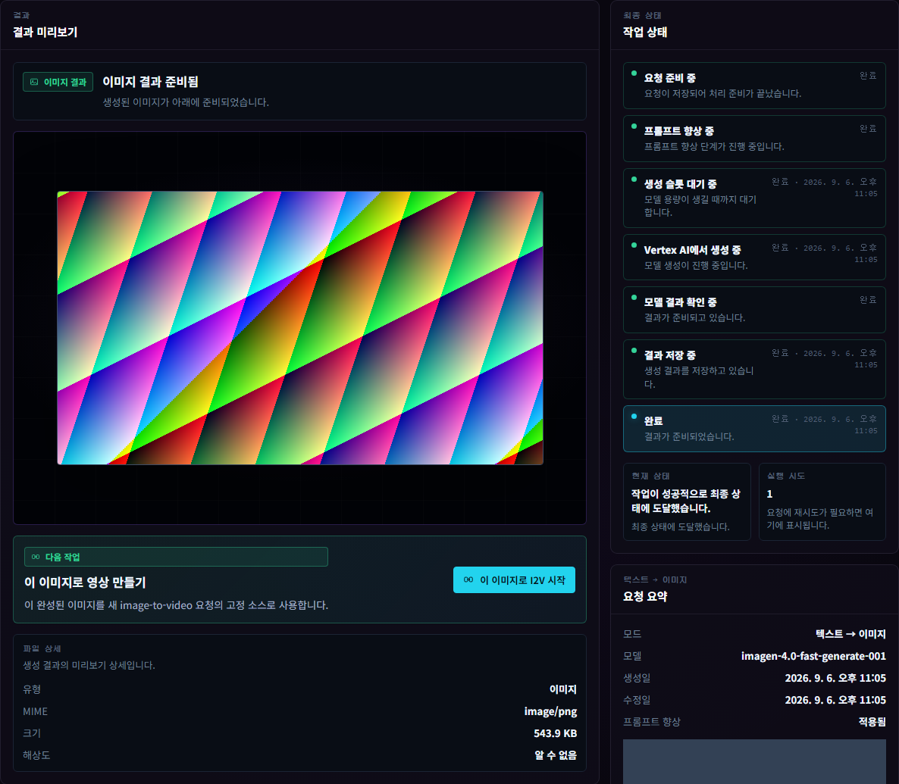
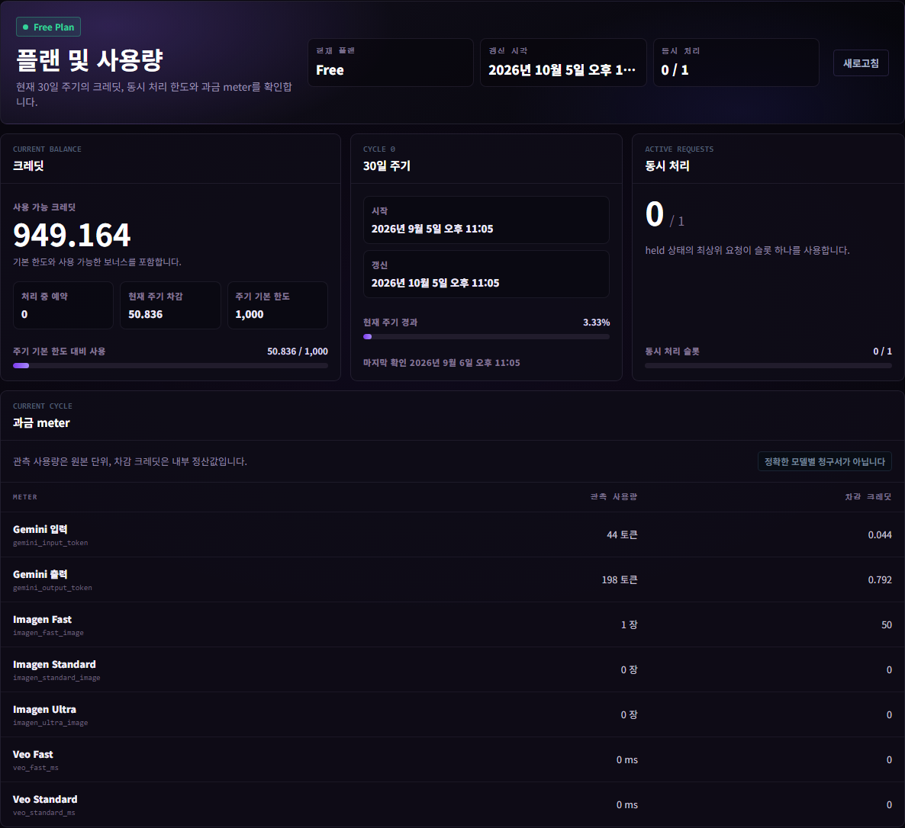
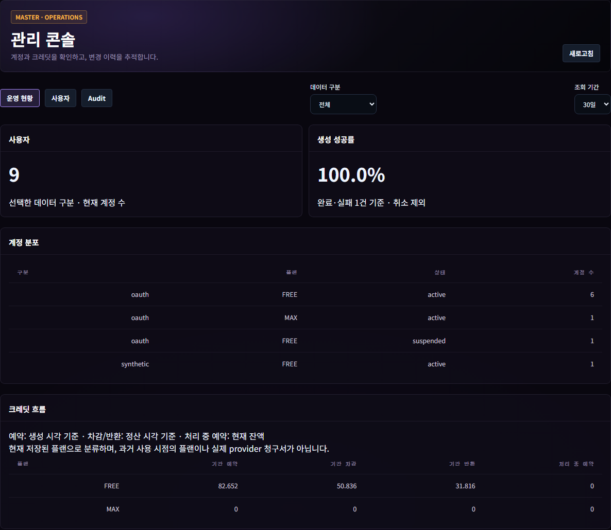
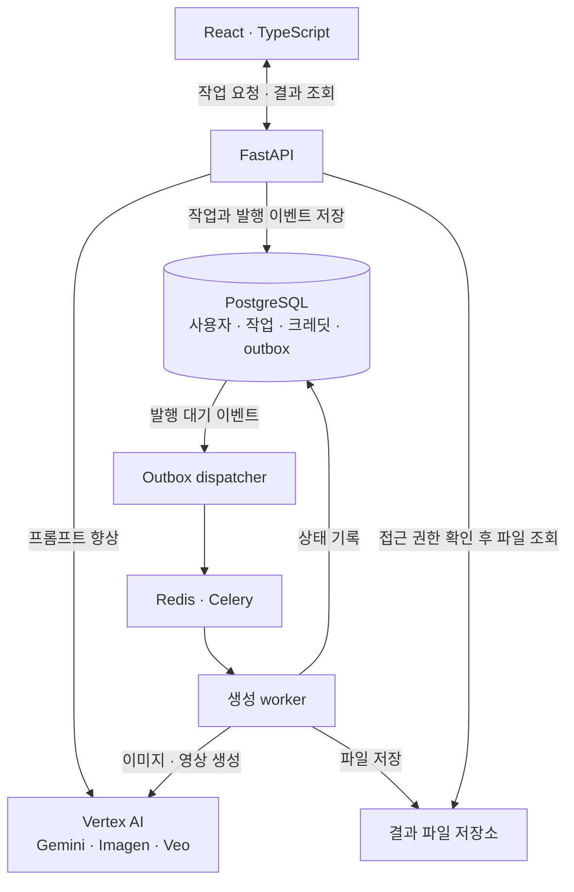

# CreativeOps Studio

**프롬프트를 다듬고 이미지와 영상을 생성하며, 작업 결과와 사용량을 관리하는 AI 콘텐츠 제작 스튜디오입니다.**

기획과 화면 설계부터 프론트엔드, 백엔드, Vertex AI 연동, 클라우드 배포와 운영 검증까지
직접 수행한 **1인 개발 프로젝트**입니다. Gemini로 생성 지시문을 다듬고, Imagen과 Veo로
이미지와 영상을 만들며, 생성한 이미지를 다음 영상 작업의 소스로 연결할 수 있습니다.

## 서비스 화면

작업 공간에서 생성 방식과 모델을 선택하고, 프롬프트를 작성해 제작을 시작합니다.
화면은 현재 코드의 로컬 mock 환경에서 촬영했습니다. 테스트 전용 사용자와 실제
API·DB·worker를 연결했으며, 유료 AI 호출과 실제 Google 로그인은 수행하지 않았습니다.
프롬프트와 식별 정보는 가렸습니다.

## 개발 배경과 목표

이미지나 영상을 만드는 과정에는 생성 요청 외에도 여러 단계가 필요합니다.
아이디어를 프롬프트로 구체화하고, 결과가 나올 때까지 기다리고, 만든 결과를 확인해
다음 작업에 연결해야 합니다. 실패한 요청을 확인하거나 이전 결과를 다시 찾는 과정도
사용 경험의 일부라고 생각했습니다.

CreativeOps Studio는 이 과정을 하나의 작업 공간에서 이어갈 수 있도록 만들었습니다.
프롬프트 향상 결과는 사용자가 검토하고 수정한 뒤 적용하도록 했고, 생성 요청은
작업으로 저장해 진행 상태와 결과물을 다시 확인할 수 있도록 구성했습니다.

개발 목표는 AI 기능을 사용자가 지속해서 이용할 수 있는 서비스로 구현하는 것입니다.
화면과 API를 연결하는 것에서 시작해, 오래 걸리는 비동기 작업, 사용자별 접근 권한,
사용량에 따른 크레딧 처리까지 범위를 확장했습니다. 이후 클라우드 배포와 부하·장애
검증을 통해 서비스가 동작하는 조건과 복구 방법을 확인했습니다.

## 핵심 기능과 사용 흐름

### 1. 프롬프트를 검토하고 다듬기

짧은 아이디어를 입력하면 Gemini 기반 프롬프트 향상 기능이 초안을 제안합니다.
사용자는 원본과 초안을 비교하고 직접 수정한 뒤 수락하거나, 원본을 유지할 수 있습니다.
최종 생성에는 사용자가 확인한 프롬프트를 사용합니다.

### 2. 이미지와 영상을 만들고 다음 작업으로 연결하기

- **텍스트 → 이미지:** Imagen으로 이미지 생성
- **텍스트 → 영상:** Veo로 영상 생성
- **이미지 → 영상:** 생성한 이미지에 움직임을 더하는 영상 제작
- **이미지 → 영상 연속 작업:** 이미지 생성 결과를 후속 영상 작업의 소스로 자동 연결

생성 요청을 제출하면 작업 상세에서 상태 변화와 결과를 확인할 수 있습니다.
완료된 이미지에서는 후속 영상 제작을 시작할 수 있고, 작업 기록에서 이전 결과를 다시 찾을 수 있습니다.

작업 상태와 결과 미리보기 화면

이 이미지는 mock provider가 반환한 테스트용 placeholder입니다.
실제 Imagen의 생성 품질을 보여주는 예시가 아니라, 요청 처리·파일 저장·미리보기 흐름을 실행한 화면입니다.

### 3. 개인 사용량과 크레딧 확인하기

사용자는 자신의 플랜, 사용 가능한 크레딧, 처리 중인 요청에 예약된 크레딧,
현재 주기의 사용량과 동시 처리 한도를 확인할 수 있습니다.
표시되는 크레딧은 서비스 내부 사용량 정책이며, 클라우드 공급자의 실제 청구서와는 구분합니다.

### 4. 관리 콘솔에서 계정과 운영 내역 확인하기

Master 권한의 관리자는 사용자 플랜 변경, 보너스 크레딧 지급, 계정 정지·재활성화를
처리할 수 있습니다. 운영 현황에서는 계정 분포, 생성 결과와 크레딧 흐름을 확인하고,
Audit에서 관리 작업의 수행자·대상·변경 전후를 추적합니다.

관리 콘솔 화면

테스트 전용 계정과 이번 촬영에서 실행한 mock 요청의 집계입니다. 실제 가입자 수나 서비스 운영 실적이 아닙니다.

## 개인 개발 범위

제품 기획부터 개발과 운영 검증까지 전체를 직접 담당했습니다.
구현 범위는 생성 화면에서 시작해 작업 처리, 사용자 관리, 클라우드 운영으로 확장했습니다.

| 영역 | 직접 설계하고 구현한 내용 |
|---|---|
| 제품·UX | 생성 모드 선택, 프롬프트 검토·수락, 결과 확인과 후속 제작 흐름 |
| 프론트엔드 | 생성 스튜디오, 작업 기록·상세, 인증 화면, 개인 사용량, 관리 콘솔 |
| 백엔드·데이터 | API, DB 모델과 migration, 비동기 작업·상태 이력, 파일 저장·접근 제어 |
| AI 연동 | Gemini·Imagen·Veo 연동, 오류 처리·재시도·요청 제한, mock/Vertex 실행 모드 |
| 사용자·사용량 | Google OAuth 연동 코드, 세션, 작업 소유권, 크레딧 예약·정산·해제, 동시 처리 제한 |
| 배포·운영 | Docker Compose, GKE·Terraform, CI/CD, 모니터링·알림, 부하와 복구 검증, 운영 절차 문서화 |

인증·크레딧·관리 기능은 격리 mock 환경에서 브라우저와 실제 백엔드를 연결해 검증했습니다.
실제 Google 로그인 및 최신 통합 기능의 배포 환경 검증은 남아 있습니다.

## 주요 문제와 해결 과정

### 생성 요청 접수와 실제 실행 사이의 누락 위험 줄이기

이미지·영상 생성은 요청을 접수한 시점과 결과가 준비되는 시점이 다릅니다.
DB에 작업을 저장하는 단계와 큐에 실행 요청을 보내는 단계 사이에서 실패하면,
사용자에게 접수된 작업이 실행되지 않을 수 있습니다.

이를 다루기 위해 작업과 발행할 이벤트를 PostgreSQL의 같은 트랜잭션에 저장했습니다.
별도의 dispatcher가 이벤트를 Redis/Celery로 보내고, worker는 DB에서 최신 작업을
읽어 처리합니다. 사용자에게 보이는 상태도 DB에 보존하고, 정해진 상태 전이 규칙으로 변경합니다.
프로세스가 하나 더 필요해지는 대신, 발행 대기와 실패를 데이터로 확인할 수 있는 구조를 선택했습니다.
[작업 처리와 복구 설계](docs/job-lifecycle.md)

### 사용자별 접근 권한과 크레딧을 작업 처리에 연결하기

여러 사용자가 요청하는 서비스에서는 작업 목록뿐 아니라 결과 파일과 후속 작업의
소스 이미지까지 소유권을 확인해야 합니다. 동시에 요청되거나 재처리되는 작업에서도
사용량과 크레딧이 일관되게 반영되어야 합니다.

작업·파일·소스 참조에 사용자 소유권 검사를 적용하고, 생성 요청 시 크레딧을 예약한 뒤
결과에 따라 정산하거나 해제하도록 구성했습니다. 중복 처리와 동시성은 DB 트랜잭션과
잠금, 재호출을 구분하는 키로 다룹니다. 격리 검증에서는 사용자 간 접근 차단과
파일 스트리밍, 동시 요청, 크레딧 처리를 확인했습니다.
[접근 제어 검증](docs/portfolio/issue-112-file-ops-access.md) ·
[생성 크레딧 검증](docs/portfolio/issue-127-generation-credit-integration.md)

### 배포 성공 여부를 확인하고 실패 시 복구하기

컨테이너가 시작되더라도 API와 worker가 정상적으로 요청을 처리할 수 있는지는
별도로 확인해야 합니다. 배포 과정에서 이 확인과 복구가 반복 가능하도록 만들었습니다.

Terraform으로 GKE 인프라와 workload를 관리하고, 이미지 digest를 기준으로 배포하도록
구성했습니다. 배포 후 상태 검사를 통과하지 못하면 이전 이미지로 되돌리는 절차를
자동화했습니다. 과거 GKE mock 검증에서는 의도적으로 배포 상태 검사를 실패시킨 뒤
API·worker·dispatcher·frontend 네 workload가 이전 digest와 readiness를 회복하는 것을 확인했습니다.
현재 GKE workload는 비용 관리를 위해 중지한 상태입니다.
[배포·복구 스크립트](scripts/deploy_gcp_release.sh) ·
[운영 검증 기록](docs/portfolio/README.md#supply-chain-and-rollback)

## 아키텍처와 기술 스택

프론트엔드는 백엔드 API를 통해 작업을 요청하고 결과를 확인합니다.
AI 호출은 백엔드의 provider 경계 안에서 처리하며, 같은 서비스 코드를
실제 Vertex AI 또는 credential이 필요 없는 mock 모드로 실행할 수 있습니다.

| 영역 | 기술 | 사용 목적 |
|---|---|---|
| 웹 화면 | React, TypeScript, Vite, TanStack Query | 제작 화면과 서버 작업 상태 조회 |
| API | Python, FastAPI, SQLAlchemy, Alembic | 요청 처리, 트랜잭션과 DB 스키마 관리 |
| 데이터·비동기 작업 | PostgreSQL, Redis, Celery | 상태·사용량 보존과 생성 작업의 별도 실행 |
| AI | Vertex AI, google-genai, Gemini, Imagen, Veo | 프롬프트 향상과 이미지·영상 생성 |
| 파일 | 공통 storage helper, 로컬 volume, GCS FUSE | 환경별 결과 파일 저장과 권한을 확인한 제공 |
| 인프라·배포 | Docker Compose, GKE, Terraform, Artifact Registry | 로컬 실행, 클라우드 구성 재현, 이미지 기반 배포 |
| 검증·관측 | pytest, Playwright, k6, Managed Prometheus | 동작·브라우저 흐름 검증, 부하 측정과 장애 관측 |
