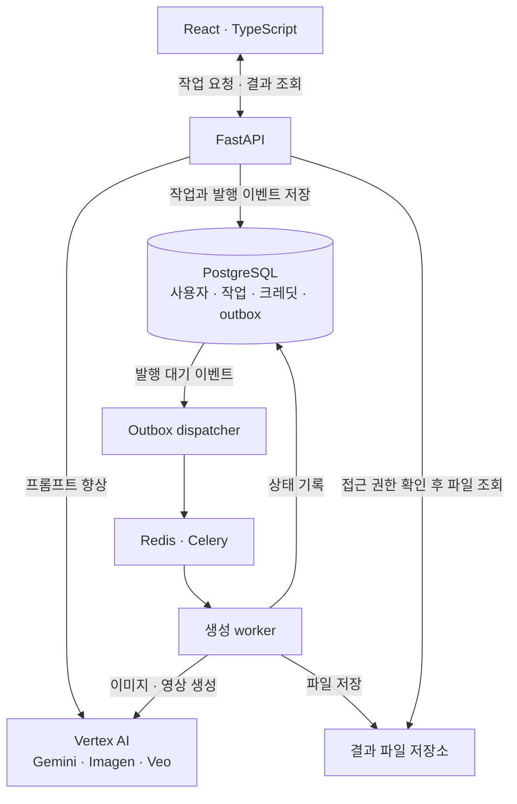

# CreativeOps Studio

**프롬프트를 다듬고 이미지와 영상을 생성하며, 작업 결과와 사용량을 관리하는 AI 콘텐츠 제작 스튜디오입니다.**

기획과 화면 설계부터 프론트엔드, 백엔드, Vertex AI 연동, 클라우드 배포와 운영 검증까지
직접 수행한 **1인 개발 프로젝트**입니다. Gemini로 생성 지시문을 다듬고, Imagen과 Veo로
이미지와 영상을 만들며, 생성한 이미지를 다음 영상 작업의 소스로 연결할 수 있습니다.

## 서비스 화면

작업 공간에서 생성 방식과 모델을 선택하고, 프롬프트를 작성해 제작을 시작합니다.
화면은 현재 코드의 로컬 mock 환경에서 촬영했습니다. 테스트 전용 사용자와 실제
API·DB·worker를 연결했으며, 유료 AI 호출과 실제 Google 로그인은 수행하지 않았습니다.
프롬프트와 식별 정보는 가렸습니다.

## 개발 배경과 목표

이미지나 영상을 만드는 과정에는 생성 요청 외에도 여러 단계가 필요합니다.
아이디어를 프롬프트로 구체화하고, 결과가 나올 때까지 기다리고, 만든 결과를 확인해
다음 작업에 연결해야 합니다. 실패한 요청을 확인하거나 이전 결과를 다시 찾는 과정도
사용 경험의 일부라고 생각했습니다.

CreativeOps Studio는 이 과정을 하나의 작업 공간에서 이어갈 수 있도록 만들었습니다.
프롬프트 향상 결과는 사용자가 검토하고 수정한 뒤 적용하도록 했고, 생성 요청은
작업으로 저장해 진행 상태와 결과물을 다시 확인할 수 있도록 구성했습니다.

개발 목표는 AI 기능을 사용자가 지속해서 이용할 수 있는 서비스로 구현하는 것입니다.
화면과 API를 연결하는 것에서 시작해, 오래 걸리는 비동기 작업, 사용자별 접근 권한,
사용량에 따른 크레딧 처리까지 범위를 확장했습니다. 이후 클라우드 배포와 부하·장애
검증을 통해 서비스가 동작하는 조건과 복구 방법을 확인했습니다.

## 핵심 기능과 사용 흐름

### 1. 프롬프트를 검토하고 다듬기

짧은 아이디어를 입력하면 Gemini 기반 프롬프트 향상 기능이 초안을 제안합니다.
사용자는 원본과 초안을 비교하고 직접 수정한 뒤 수락하거나, 원본을 유지할 수 있습니다.
최종 생성에는 사용자가 확인한 프롬프트를 사용합니다.

### 2. 이미지와 영상을 만들고 다음 작업으로 연결하기

- **텍스트 → 이미지:** Imagen으로 이미지 생성
- **텍스트 → 영상:** Veo로 영상 생성
- **이미지 → 영상:** 생성한 이미지에 움직임을 더하는 영상 제작
- **이미지 → 영상 연속 작업:** 이미지 생성 결과를 후속 영상 작업의 소스로 자동 연결

생성 요청을 제출하면 작업 상세에서 상태 변화와 결과를 확인할 수 있습니다.
완료된 이미지에서는 후속 영상 제작을 시작할 수 있고, 작업 기록에서 이전 결과를 다시 찾을 수 있습니다.

작업 상태와 결과 미리보기 화면

이 이미지는 mock provider가 반환한 테스트용 placeholder입니다.
실제 Imagen의 생성 품질을 보여주는 예시가 아니라, 요청 처리·파일 저장·미리보기 흐름을 실행한 화면입니다.

### 3. 개인 사용량과 크레딧 확인하기

사용자는 자신의 플랜, 사용 가능한 크레딧, 처리 중인 요청에 예약된 크레딧,
현재 주기의 사용량과 동시 처리 한도를 확인할 수 있습니다.
표시되는 크레딧은 서비스 내부 사용량 정책이며, 클라우드 공급자의 실제 청구서와는 구분합니다.

### 4. 관리 콘솔에서 계정과 운영 내역 확인하기

Master 권한의 관리자는 사용자 플랜 변경, 보너스 크레딧 지급, 계정 정지·재활성화를
처리할 수 있습니다. 운영 현황에서는 계정 분포, 생성 결과와 크레딧 흐름을 확인하고,
Audit에서 관리 작업의 수행자·대상·변경 전후를 추적합니다.

관리 콘솔 화면

테스트 전용 계정과 이번 촬영에서 실행한 mock 요청의 집계입니다. 실제 가입자 수나 서비스 운영 실적이 아닙니다.

## 개인 개발 범위

제품 기획부터 개발과 운영 검증까지 전체를 직접 담당했습니다.
구현 범위는 생성 화면에서 시작해 작업 처리, 사용자 관리, 클라우드 운영으로 확장했습니다.

| 영역 | 직접 설계하고 구현한 내용 |
|---|---|
| 제품·UX | 생성 모드 선택, 프롬프트 검토·수락, 결과 확인과 후속 제작 흐름 |
| 프론트엔드 | 생성 스튜디오, 작업 기록·상세, 인증 화면, 개인 사용량, 관리 콘솔 |
| 백엔드·데이터 | API, DB 모델과 migration, 비동기 작업·상태 이력, 파일 저장·접근 제어 |
| AI 연동 | Gemini·Imagen·Veo 연동, 오류 처리·재시도·요청 제한, mock/Vertex 실행 모드 |
| 사용자·사용량 | Google OAuth 연동 코드, 세션, 작업 소유권, 크레딧 예약·정산·해제, 동시 처리 제한 |
| 배포·운영 | Docker Compose, GKE·Terraform, CI/CD, 모니터링·알림, 부하와 복구 검증, 운영 절차 문서화 |

인증·크레딧·관리 기능은 격리 mock 환경에서 브라우저와 실제 백엔드를 연결해 검증했습니다.
실제 Google 로그인 및 최신 통합 기능의 배포 환경 검증은 남아 있습니다.

## 주요 문제와 해결 과정

각 사례는 **어떤 문제가 있었는지 → 왜 그 방법을 선택했는지 → 무엇을 직접
구현했는지 → 어떻게 검증했는지** 순서로 정리했습니다. 통과한 결과뿐 아니라 실제로
발견한 결함과 아직 검증하지 않은 범위도 함께 기록합니다.

### 1. 접수된 생성 작업이 큐 전달 실패로 사라지지 않게 만들기

- **문제:** 이미지·영상 생성은 API 응답 뒤에도 계속되는 비동기 작업입니다. DB에
  작업을 저장한 직후 큐 발행이 실패하면 사용자는 접수된 작업을 보지만 worker는 그
  작업을 받지 못할 수 있습니다.
- **선택 이유:** API가 DB 저장과 Redis 발행을 직접 연속 수행하는 대신 transactional
  outbox를 선택했습니다. 작업과 발행 의도를 한 트랜잭션에 남기면 장애가 발생해도
  미발행 이벤트를 조회하고 재전송할 수 있고, 사용자에게 보이는 상태의 source of
  truth를 PostgreSQL 하나로 유지할 수 있기 때문입니다.
- **직접 구현:** FastAPI가 Job과 outbox event를 함께 저장하고, 별도 dispatcher가
  `job_id`만 Celery에 전달하도록 구성했습니다. worker는 DB에서 최신 Job을 다시 읽고,
  모든 상태 변경은 공통 state machine을 통과합니다. 중복 task는 no-op 처리하고,
  발행 실패와 중단된 polling 작업을 운영 화면과 복구 명령에서 확인할 수 있게 했습니다.
- **검증:** mock 통합 QA에서 Pipeline 8/8, History 6/6, Retry 6/6 assertion이
  통과했습니다. outbox 재시도·중복 task·pending repair는 backend 회귀 테스트에
  포함했습니다. 이는 로컬 mock 검증이며 실제 Vertex 장애의 최신 재검증은 아닙니다.

[작업 처리와 복구 설계](docs/job-lifecycle.md) ·
[통합 QA Receipt](docs/portfolio/issue-186-aggregate-receipt.md)

### 2. 사용자 소유권과 크레딧을 동시 요청에서도 일관되게 지키기

- **문제:** 작업 목록만 사용자별로 나누어도 파일 URL이나 후속 영상의 소스 참조에서
  권한을 다시 확인하지 않으면 다른 사용자의 결과에 접근할 수 있습니다. 또한 동시
  요청·재시도에서 크레딧 예약과 정산이 분리되면 초과 사용이나 이중 차감이 생깁니다.
- **선택 이유:** 애플리케이션 메모리나 worker 상태가 아니라 DB 트랜잭션과 row lock을
  경계로 선택했습니다. API admission과 비동기 완료가 서로 다른 프로세스에서 실행돼도
  같은 불변식을 적용하고, 거부된 요청은 큐와 provider까지 가지 않게 하기 위해서입니다.
- **직접 구현:** Job·Asset·pipeline source에 owner를 저장하고 metadata 조회, 파일
  streaming/Range, 삭제, 운영 API까지 owner/Master 정책을 적용했습니다. 생성 전에는
  크레딧을 원자적으로 예약하고 성공·실패·재시도 결과에 따라 settle/release하며,
  idempotency key와 잠금으로 중복 처리를 막았습니다.
- **검증:** 소유권·파일 검증은 실제 PostgreSQL/Redis mock runtime 네 cycle에서
  998.187초 동안 metadata 348개와 file-ops 310개 검사를 포함해 통과했습니다. 생성
  크레딧은 두 독립 cycle에서 각각 8개 그룹, 2개 race, 120개 검사를 통과했고 cleanup
  잔존 리소스는 0개였습니다. 실제 결제나 provider 청구 대사는 범위에 포함하지 않았습니다.

[접근 제어 검증](docs/portfolio/issue-112-file-ops-access.md) ·
[생성 크레딧 검증](docs/portfolio/issue-127-generation-credit-integration.md)

### 3. 배포 성공을 선언하기 전에 상태를 확인하고 자동 복구하기

- **문제:** 컨테이너 rollout이 끝났다는 사실만으로 API·worker·dispatcher·frontend가
  정상 요청을 처리한다고 볼 수 없습니다. 새 이미지가 readiness나 외부 health gate를
  통과하지 못하면 일부 workload만 바뀐 채 서비스가 남을 수 있습니다.
- **선택 이유:** 수동 `kubectl` 복구 대신 Terraform plan과 immutable image digest를
  배포 계약으로 선택했습니다. 변경 범위를 사전에 검토하고, 실패 시 같은 IaC 경계로
  이전 네 workload digest를 재적용해야 복구 절차를 반복할 수 있기 때문입니다.
- **직접 구현:** 컨테이너 scan/SBOM gate, digest 전용 release 입력, rollout 대기,
  bounded external health check, 이전 digest 캡처와 Terraform 자동 rollback을 연결했습니다.
  GKE resource/probe/HPA 설정과 운영 runbook도 같은 변수 계약에 맞췄습니다.
- **검증:** 과거 실제 GKE 환경에서 의도적으로 candidate health gate를 실패시켰고,
  네 workload가 이전 digest와 readiness를 회복한 뒤 mock health가 정상화되는 것을
  확인했습니다. 별도 HPA 검증은 590 iterations·1,770 HTTP requests에서 checks 100%,
  HTTP failure 0%, p95 53ms였습니다. 현재 GKE workload와 node pool은 비용 관리를 위해
  중지되어 있으며 이 수치는 현재 운영 트래픽이 아닙니다.

[배포·복구 스크립트](scripts/deploy_gcp_release.sh) ·
[GKE 운영 runbook](docs/runbooks/gcp-gke.md) ·
[운영 검증 기록](docs/portfolio/README.md#supply-chain-and-rollback)

### 4. “테스트 실행 완료”와 “제품 품질 통과”를 구분하기

- **문제:** 기능별 테스트가 흩어져 있으면 Agent나 사람이 일부 성공 결과만 모아 전체
  사용자 흐름이 안전하다고 판단할 수 있습니다. 빠른 mock 상태 전이를 브라우저 polling이
  놓치거나, 실행은 완료됐지만 제품 assertion은 실패한 결과를 PASS로 오해할 수도 있습니다.
- **선택 이유:** 임의 체크리스트 대신 versioned QA Contract와 immutable revision 기반
  Receipt를 선택했습니다. 도구·evidence·cleanup 누락은 `BLOCKED`, 제품 기대 위반은
  `FAIL`로 분리하고, 알려진 결함을 allow-fail로 숨기지 않기 위해서입니다.
- **직접 구현:** 변경 경로를 10개 사용자 시나리오에 매핑하는 Impact Selector, 실제
  Chrome DevTools와 owned mock runtime을 구동하는 Executor/Adapter, 68개 assertion을
  집계하는 Receipt gate를 만들었습니다. 서로 다른 revision, source 변경, cleanup 잔존,
  scenario 누락은 결과 재사용 단계에서 거부합니다.
- **검증:** revision `f6ca646`에서 10개 시나리오와 68개 assertion을 550.656초에
  실행했습니다. 결과는 58 PASS, 10 FAIL, 0 BLOCKED였고 gate는 `REJECT`를 반환했습니다.
  Free plan 정책 side effect, 재생 불가능한 mock video, 접근 불가능한 Ops 메뉴 노출 등
  실제 제품 결함을 성공으로 포장하지 않고 후속 수정 대상으로 남겼습니다.

[QA Contract와 Registry](docs/portfolio/issue-176-qa-contract-registry.md) ·
[Aggregate Receipt 결과](docs/portfolio/issue-186-aggregate-receipt.md)

## 아키텍처와 기술 스택

프론트엔드는 백엔드 API를 통해 작업을 요청하고 결과를 확인합니다.
AI 호출은 백엔드의 provider 경계 안에서 처리하며, 같은 서비스 코드를
실제 Vertex AI 또는 credential이 필요 없는 mock 모드로 실행할 수 있습니다.

| 영역 | 기술 | 사용 목적 |
|---|---|---|
| 웹 화면 | React, TypeScript, Vite, TanStack Query | 제작 화면과 서버 작업 상태 조회 |
| API | Python, FastAPI, SQLAlchemy, Alembic | 요청 처리, 트랜잭션과 DB 스키마 관리 |
| 데이터·비동기 작업 | PostgreSQL, Redis, Celery | 상태·사용량 보존과 생성 작업의 별도 실행 |
| AI | Vertex AI, google-genai, Gemini, Imagen, Veo | 프롬프트 향상과 이미지·영상 생성 |
| 파일 | 공통 storage helper, 로컬 volume, GCS FUSE | 환경별 결과 파일 저장과 권한을 확인한 제공 |
| 인프라·배포 | Docker Compose, GKE, Terraform, Artifact Registry | 로컬 실행, 클라우드 구성 재현, 이미지 기반 배포 |
| 검증·관측 | pytest, Playwright, k6, Managed Prometheus | 동작·브라우저 흐름 검증, 부하 측정과 장애 관측 |
