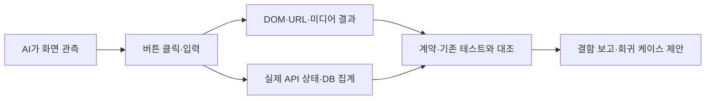

# Issue164 — AI가 직접 수행한 버튼 탐색 QA와 E2E 공백 분석

판정: **탐색 QA 수행 완료 / 제품 QA 통과 아님**. 일반 사용자가 접근할 수 있는
화면의 서로 다른 버튼 동작을 실행했고, 아래 결함과 제한을 확인했다. 제품 수정은
이번 작업에 포함하지 않았다.

전달: [Issue164](https://github.com/bbungjun/AI_multimodal_platform/issues/164),
[Draft PR165](https://github.com/bbungjun/AI_multimodal_platform/pull/165),
QA 기록 commit `7bf0f29`. PR163의 mock OAuth 코드에 의존하며 병합은 하지 않았다.

## 실행 증거

- 대상 코드: `28f5c58241f5d56acaf02549d78da456f355879b` (PR163 기반).
- 실행 시각: 2026-09-13 13:43:32–13:50:55 KST (04:43:32–04:50:55 UTC).
- 환경: `creativeops-mock-oauth-preview`, frontend `http://127.0.0.1:18156`,
  backend loopback `18001`, test-only mock OAuth, AI provider mock, 일반 사용자/Free.
- AI가 브라우저 도구로 클릭·키보드 입력·선택·화면 판정을 수행했다.
  [행동/관측 일지 45개](../evidence/issue-164/ai-qa-session.json)에는 시각과 결과를 남겼다.
  이는 클릭 수나 독립 테스트 45개라는 뜻이 아니다. 입력 도구 실패 1건과
  페이지 경계 준비용 재시도 4건도 그대로 포함한다.
- [정제한 API 이벤트 191개](../evidence/issue-164/http-events.json)는 실제 backend
  access log에서 추출했다. 이 중 health 요청90개는 preflight와 자동 polling을
  포함한다. 5xx는0개, 4xx는5개였다. 2xx도 기능 요구사항을 위반할 수 있다.
- PostgreSQL 읽기 전용 집계: 완료4개, 의도된 mock 실패6개, 진행 중0개.
  이번 QA가 생성한 Job11개 중 실패 Job1개가 삭제되어10개가 남았다.
  예약은 settled7개(향상3+생성4), released7개, held0개다.

일지는 도구 실행 결과를 AI가 정리한 기록이며 암호학적으로 검증된 녹화물이 아니다.
backend 이벤트와 행동은 시각/경로로 대조했다. 요청별 trace ID는 아직 없으므로
모든 polling 요청을 특정 클릭에 일대일 귀속시키지 않는다. 이번 탐색에서는 별도
브라우저 outbound 수집기를 설치하지 않았다. 기존 mock OAuth verifier의
`external_requests=0`을 이번 실행의 독립 측정값으로 옮겨 적지 않는다.

## 확인한 문제

| ID / 우선순위 | 실제 재현 | API·코드 근거 | 판정 |
|---|---|---|---|
| F01 / P1 | Free에서 Fast 이미지2장 및 T2V6초를 선택해 생성. 각각 완료되었고 이미지2개/영상6초가 상세 및 DB에 남음 | `POST /api/generations` 모두201. [합의 표](../initiatives/auth-credits-master-console.md)는 Free1장/4초. `credit_policy.py`에도1/4가 있지만 `max_images`, `max_video_seconds`를 요청 경계에서 소비하는 코드가 없음 | **API 플랜 한도 미집행**. 금액/모델/동시성 검사와 별개의 요청 크기 제한 누락 |
| F02 / P2 | 모델·템플릿·사이드바 설정·상단 설정 클릭 후 화면 변화 없음. 검색 모양 영역 클릭도 변화 없음 | 메뉴 네 개는 `frontend/src/App.tsx`에 동작 핸들러가 없는 button. 검색은 `aria-hidden` 장식 div. 해당 API 호출 없음 | **미구현 UI**. 실패한 API가 아니라 연결 자체가 없음 |
| F03 / P2 | Free에서 Imagen Standard 선택 후 생성하면 `credit_plan_refused` 원문. 잔액247.612에서 기본 Pipeline 생성 시 `monthly_credit_exhausted` 원문 | `POST /api/generations`403, `POST /api/pipelines`402 | API 거절은 정상. **선택 가능 모델·잔액 사전 안내와 사용자용 오류 문구 부족** |
| F04 / P2 | 일반 사용자에게 보이는 운영 메뉴를 클릭하면 ‘사용 불가 / master_required’ | `GET /api/ops/health`403, 체류 중3회 관측. `require_master`는 정상. App nav는 일반 사용자에게도 ops 노출 | **권한과 내비게이션 UX 불일치**. 권한 우회나 서버 장애 아님 |
| F05 / P2 | I2V/T2V 완료 화면은 ‘재생 컨트롤 사용 가능’이라 안내하지만 실제 미디어 영역은 재생 불가 | `/files/{id}/output.mp4`206. 4초290B/6초396B. `mock_media.generate_mock_mp4`는 ftyp/free/mdat placeholder를 만들며 재생 가능한 영상 트랙이 없음 | **mock 미디어 한계와 오류 UX**. 파일 API206 성공은 재생 성공을 증명하지 않음 |
| F06 / P2 | 단일/복수 이미지 및 영상 상세를 조사했지만 일반적인 다운로드 버튼/링크가 없음 | `JobDetailPage.tsx`, `PipelinePage.tsx`: 이미지에는 download 동작 없음. 영상 ‘열기’ 링크는 video fallback child라 현재 오류 화면에서 접근할 수 없음 | **파일 전달 UX 공백**. 파일 GET은 동작; 사용자 클릭 다운로드는 미검증/진입점 부재 |
| F07 / P3 | 기록 실제 행6·7·10개일 때에도 메뉴 숫자는8. mock 작업 상태 타임라인에도 Vertex AI 문구 노출 | `App.tsx`의 기록8 고정값. `JobDetailPage.tsx`의 provider와 무관한 상태 문구 | **상태 표시 정확성 문제**. 좁은 현재 viewport에서 숨겨진 footer의412ms 값은 코드 관측일 뿐 이번 화면 증거로 세지 않음 |
| F08 / P2 후보 | 로그아웃→기록 링크→로그인 게이트의 Google 버튼→로그인 성공 후 `/history` 대신 `/generate` | logout이 `returnTo`를 generate로 설정하고 익명 상태의 후속 메뉴 클릭은 갱신하지 않음. OAuth는307→303→me200 성공 | **복귀 의도 유실 후보**. 보안 차단은 정상; 기대 UX 확정 후 회귀 케이스 추가 |

F01의 DB 재확인 결과는 다음과 같다. 사용자/Job 식별자나 프롬프트를 기록하지 않았다.

| 현재 plan | 모드 | 저장된 요청 크기 | 최종 상태 |
|---|---|---|---|
| free | t2i | number_of_images=2 | completed |
| free | t2v | duration_sec=6 | completed |

## API 목록과 판정

| 요청 | 실제 상태 / 횟수 | 판정 |
|---|---|---|
| `POST /api/generations` | 201×5,403×1 | 성공 접수에도 F01 포함. 403은 금지 모델 거절 |
| `POST /api/generations/{id}/retry` | 201×6 | 상세/기록 재시도 모두 새 작업 생성. 실패 sentinel 유지로 다시 실패하는 것이 예상 동작 |
| `GET /api/generations/{id}` | 200×25 | 상세/상태 조회 정상 |
| `GET /api/generations` | 200×26 | 필터·페이지·행 이동 정상. 입력/재조회 때문에 요청 수는 클릭 수와 다름 |
| `DELETE /api/generations/{id}` | 204×1 | 이번 QA의 실패 작업1개 삭제됨. 확인 UX는 아래 제한 참고 |
| `POST /api/prompts/enhance` | 201×3 | 초안 생성 정상; 버리기/원본 유지/편집·수락은 로컬 상태 변경 |
| `POST /api/pipelines` | 402×1 | 충분하지 않은 잔액에 대한 정상 거절. 성공 Pipeline 및 상세 버튼은 이번 실행에서 미검증 |
| `GET /api/assets/{id}` | 200×3 | I2V 소스 선택 정상 |
| `GET /files/{id}/output.png` | 200×10 | 이미지 디코딩 확인 |
| `GET /files/{id}/output-2.png` | 200×1 | 두 번째 이미지 디코딩 확인 |
| `GET /files/{id}/output.mp4` | 206×8 | Range 전달 정상, 영상 재생 실패(F05) |
| `GET /api/usage/me` | 200×2 | Free/차감/예약 표시 및 새로고침 정상 |
| `GET /api/ops/health` | 403×3 | 일반 사용자 정상 거절; 노출 메뉴·오류 문구 문제(F04) |
| `POST /api/auth/logout` | 204×1 | 작업공간 잠금 정상 |
| `GET /api/auth/google/start` | 307×1 | mock callback으로 이동 |
| `GET /api/auth/google/callback` | 303×1 | 실제 Session 발급·앱 복귀 |
| `GET /api/auth/me` | 200×3 | 세션 확인 정상. 로그아웃 후 이번 화면 흐름은 로컬 gate로 차단했으므로401 관측을 꾸며 넣지 않음 |
| `GET /api/health` | 200×90 | preflight/polling 정상 |

## 버튼 실행 범위

서로 같은 행에서 반복되는 삭제/재시도 버튼은 대표 행으로 검사했다. 일반 사용자에게
보이지 않는 Master 콘솔은 권한을 변경해서 열지 않았다. 모든 가능한 계정·네트워크·
오류 상태를 다 테스트했다는 뜻은 아니다.

| 동작 묶음 | 이번 조작 및 결과 | 일지 |
|---|---|---|
| 공통 메뉴4개/검색 | 모두 클릭, 미연결 | QA01–04,41 |
| 계정/닫기/로그아웃/로그인 | 팝오버·Escape·logout·mock login 실행 | QA05,38–40 |
| 홈/생성/기록/사용량/운영 | 전부 실제 링크 이동 | QA11–13,24–25,28–33,37,39 |
| T2I/T2V/I2V/PIPELINE | 모든 탭 전환 | QA06–08,14,22,26 |
| 모델/비율/장수/길이/스타일 | 각각 선택값 변경; 변경 파라미터를 상세에서 확인 | QA18–23,26 |
| 빈 입력·I2V 소스 없음 | 실제0자 및 소스 없음에서 생성/향상 비활성 확인 | QA07,11,14 |
| 향상·버리기·원본 유지·수락 | 모두 실행. 수락 전 초안 편집도 실행 | QA15–17 |
| T2I/I2V/T2V 생성 | 실제 worker 완료와 결과 표시 | QA10–13,20–23 |
| 단일/복수 결과의 I2V 버튼 | 단일1개, 복수2개 각각 클릭·서로 다른 소스 연결 | QA11,20–21 |
| 영상 재생 | native player가 이미 오류/스크러버 비활성; 재생 성공 검증 불가 | QA13,23 |
| Pipeline 생성 | 클릭402; 성공 시 나타나는 상세는 미검증 | QA26 |
| 상세/기록의 재시도 | 양쪽 클릭201. 페이지 준비용 반복4회 별도 기록 | QA27–28,PAG1–4 |
| 기록 모드/결과/상태/모델/페이지 크기 | 각각 조작, 결합 빈 결과 확인 | QA29–32 |
| 이전/다음/행 선택 | 10행 경계→빈2페이지→1페이지 복귀→행 상세 이동 | QA35–37 |
| 삭제 | 대표 실패 행1개 삭제204. 확인창/취소 경로는 검증하지 못함 | QA34 |
| 다운로드 | 클릭 가능한 진입점 없음 | F06 |

삭제는 되돌릴 수 없어서 최종 실행에 대한 확인을 요청했다. 그 뒤 버튼으로 확인창을
열려는 단계에서 도구가 timeout을 반환했지만 실제 요청은204로 완료됐다. 확인창
handle은 반환되지 않았다. 이를 ‘확인/취소 UX 통과’로 기록하지 않았고, 삭제된
테스트 작업1개와 추가 삭제 중단을 사용자에게 알렸다. 나머지 QA 산출물10개는
검토를 위해 preview에 남겼으며, 기존 사용자 작업을 삭제한 것으로 주장하지 않는다.

## 기존 E2E가 작성되어 있는가

**일부 경로에는 있다. 이번에 발견한 공백을 포괄하는 버튼 기반 E2E는 없다.**
아래는 현재 checkout의 테스트를 직접 읽어 내린 판정이다.

| 영역 | 기존 구현 | 실제 커버 범위 / 공백 |
|---|---|---|
| 인증·계정·로그아웃 | `frontend/tests/auth-ux.spec.ts`, `mock-oauth-browser-driver.mjs` | frontend fixture 기반 UX와 real-route mock OAuth가 있음. logout 후 다른 익명 메뉴를 클릭하고 로그인하는 F08은 없음 |
| 사용량·새로고침·실패 재시도 | `frontend/tests/usage-ux.spec.ts` | loading/error401/503/malformed/수동 refresh/응답경쟁/반응형 검증. 이 테스트의 API는 stub |
| 실백엔드 이미지·소유권 | `frontend/tests/browser-acceptance-driver.mjs` | 실제 backend/DB/worker로1장 생성·파일GET·상세 표시. 생성 요청은 browser 내부 fetch helper로 보내며 생성 버튼 클릭을 검증하지 않음 |
| 향상 수락·이미지 생성 버튼 | `frontend/scripts/capture-readme.mjs` | real runtime 스크린샷 캡처 과정에 향상/수락/생성 클릭과 결과 검증이 있음. 일반 회귀 suite의 버리기·원본 유지·편집 값 일치까지 포괄하지 않음 |
| 플랜 제한 | `backend/tests/test_credit_policy.py` | Free의1장/4초 정책 값은 검사. 그 값을 실제 POST 입구에서 거부하는 케이스는 없음(F01) |
| 모델·크레딧 거절 | generation/accounting backend tests | 금지 meter/잔액 거절 검증. 화면의 선택 제한·오류 번역은 미커버(F03) |
| 영상 | `backend/tests/test_mock_provider.py` | mock operation/반환 bytes 검사. 브라우저의 영상 decode/재생 또는 오류 fallback을 검증하지 않음(F05) |
| 기록 필터·삭제·재시도 | ownership/API 검증과 일부 Session history test | backend 동작 증거는 있지만 현재 페이지의 모든 버튼·대화상자·필터·페이지 이동을 연결한 정식 browser suite는 확인되지 않음 |
| 공통 메뉴·검색·다운로드·숫자8 | 없음 | F02/F06/F07을 포착할 사용자 동작 회귀 없음 |

새로 제안한 실행 가능한 명세는 [회귀 테스트 케이스](../qa/issue-164-regression-cases.md)에
Given/When/Then으로 정리했다. **명세 작성과 자동 실행 코드 구현은 별개**다.
이번에는 제품/테스트 스크립트를 수정하지 않았다.

## Fresh verification

| 명령 | 실제 결과 |
|---|---|
| `cd frontend; npm run test:auth:browser` | 61 passed / 41.6s. 기존 fixture 기반 Chromium suite |
| `cd backend; AI_PROVIDER=mock python -m pytest tests/test_credit_policy.py tests/test_generation_api.py tests/test_generation_credit.py tests/test_ops_api.py -q` | 179 passed / 4.98s |
| frontend18156 + backend18001 실제 browser QA | 위45개 관측과191개 HTTP 이벤트. 발견한 결함 때문에 제품 전체 PASS로 간주하지 않음 |

기존 테스트가 모두 녹색이어도 요청 계약(F01)이나 실제 버튼 연결(F02)을 보장하지
않는다는 것이 이번 QA의 핵심 결과다. 61개를 real-backend E2E61개로 표현하지 않는다.

## 포트폴리오에서 사용할 수 있는 표현

> AI 에이전트가 mock OAuth 환경에서 생성 스튜디오의 버튼을 직접 조작하고,
> 45개 행동/관측과191개 API 응답을 수집·대조했다. 기존 브라우저 테스트61개와
> 관련 백엔드 테스트179개가 통과하는 상태에서도 Free 요청 크기 제한 누락,
> 미연결 메뉴, 영상 재생 및 권한 오류 UX 공백을 확인했다. 재현 절차와
> 기존 E2E 커버리지, 후속 회귀 케이스를 증거와 함께 문서화했다.

실제 Google·Vertex 검증, 모든 역할/상태의 완전한 E2E, 결함 수정 완료, 주기적
무인 QA 자동화 구축 완료로 확대해서 표현하지 않는다.

## 다음 작업과 되돌리기

1. F01의 Free1장/4초 요청 제한을 backend admission에서 검증하고 실제 HTTP 회귀를 추가.
2. F02/F03/F04/F05/F06의 사용자 흐름을 각각 좁은 Issue로 수정.
3. action_id와 request/trace ID를 연결하는 정제된 수집기 및 검토용 artifact 저장을 구축.
4. AI가 생성한 후보 케이스를 별도 검토 후 CI 회귀에 편입. 관측된 오류를 정답으로
   학습시켜 `403이 보이면 PASS`처럼 요구사항을 약화시키지 않음.

이번 변경은 문서/정제 evidence뿐이라 제품 rollback은 필요 없다. preview를 정리할
때는 해당 프로젝트만 대상으로 하고 이 QA가 남긴 데이터와 사용자의 후속 작업을
구별해야 한다. 넓은 Docker prune이나 DB reset은 수행하지 않았다.
