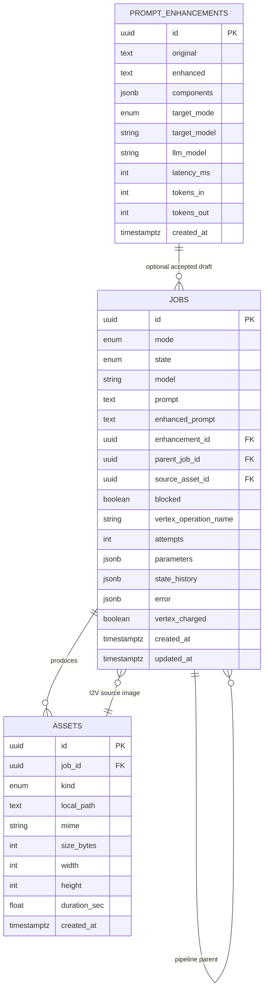

# ERD Explanation Note

작성일: 2026-05-27

이 문서는 KRAFTON take-home assignment 복구본의 ERD를 설명하기 위한 노트입니다.
목표는 새 schema를 제안하는 것이 아니라, 현재 `backend/app/models.py`,
`README.md`, `pre_context` 요약, recovery 문서에 근거해 최종 제출 플랫폼의
데이터 모델을 말로 설명할 수 있게 정리하는 것입니다.

실제 Vertex/Gemini/Imagen/Veo 호출이나 live QA는 포함하지 않습니다.

## 한 문장 설명

이 서비스의 데이터 모델은 `jobs`를 생성 작업의 source of truth로 두고,
생성 결과 파일은 `assets` metadata와 로컬 `DATA_DIR` 파일로 분리하며,
Gemini prompt enhancement는 `prompt_enhancements`에 검토 가능한 초안으로
저장한 뒤 사용자가 수락한 경우에만 `jobs.enhancement_id`로 연결합니다.

## ERD

## 테이블별 역할

### `jobs`

`jobs`는 모든 생성 요청의 중심 테이블입니다. T2I, T2V, I2V를 별도 테이블로
나누지 않고 `mode`로 구분한 이유는 job lifecycle, runner claim, 상태 전이,
history 조회, 삭제 정책을 하나의 공통 계약으로 관리하기 위해서입니다.

핵심 필드:

- `mode`: `t2i`, `t2v`, `i2v` 중 어떤 생성 흐름인지 나타냅니다.
- `state`: `pending`, `queued`, `generating`, `polling`, `downloading`,
  `completed`, `failed`, `cancelled` 같은 lifecycle 상태입니다.
- `prompt`: 최종 generation prompt의 source of truth입니다. Prompt Enhancement
  결과가 있어도 사용자가 수락/수정해서 generation payload로 보낸 값이 여기에
  저장됩니다.
- `parameters`: aspect ratio, image count, duration 같은 mode별 옵션을 JSONB로
  보관합니다.
- `state_history`: state machine을 거친 전이 이력을 JSONB로 남겨 Job Detail
  timeline과 장애 분석에 사용합니다.
- `vertex_operation_name`: Veo long-running operation을 재개하기 위한 operation
  name입니다.
- `error`: provider failure classification, validation failure 등 public error
  payload를 저장합니다.

### `assets`

`assets`는 생성 결과 파일의 metadata입니다. 실제 binary bytes는 DB에 넣지 않고
`DATA_DIR/{job_uuid}/{filename}` 아래 로컬 파일로 저장합니다. DB에는 그 파일을
찾기 위한 `local_path`, 종류, MIME, 크기, 이미지/비디오 metadata만 저장합니다.

이 분리는 두 가지 의미가 있습니다.

- DB는 job 상태와 결과 metadata를 빠르게 조회하는 역할에 집중합니다.
- 파일 접근은 storage helper와 `/files/{job_uuid}/{filename}` route가 UUID
  directory, filename, `DATA_DIR` containment를 검증한 뒤 처리합니다.

T2I는 한 job이 여러 image asset을 만들 수 있으므로 `jobs 1:N assets`가
필요합니다. T2V/I2V는 보통 video asset 하나를 만들지만 같은 관계를 재사용합니다.

### `prompt_enhancements`

`prompt_enhancements`는 Gemini가 만든 prompt 개선 초안을 저장합니다. 이 테이블은
generation job 자체가 아니라 "사용자가 검토할 수 있는 초안"을 저장하는 역할입니다.

핵심 설계는 review-first입니다.

- Gemini 결과는 generation prompt를 자동으로 덮어쓰지 않습니다.
- 사용자가 원본/개선본/components를 비교하고 수정한 뒤 수락해야 합니다.
- 수락된 경우 generation request가 `enhancement_id`를 함께 보내고, job은 그
  enhancement row를 선택적으로 참조합니다.
- 그래도 최종 prompt의 source of truth는 `jobs.prompt`입니다.

## 관계별 설명

### `prompt_enhancements.id -> jobs.enhancement_id`

하나의 prompt enhancement 초안은 여러 job에서 참조될 수 있는 optional 관계입니다.
실제 사용 흐름에서는 사용자가 초안을 수락한 뒤 생성 요청을 보낼 때 job에
`enhancement_id`가 연결됩니다.

API는 enhancement의 `target_mode`, `target_model`이 generation 요청의 `mode`,
`model`과 맞는지 다시 검증합니다. 그래서 UI에서 잘못 연결하더라도 backend에서
mode/model mismatch를 막을 수 있습니다.

### `jobs.id -> assets.job_id`

한 job은 0개 이상의 asset을 가질 수 있습니다.

- active 또는 실패한 job은 asset이 없을 수 있습니다.
- T2I multi-image 결과는 image asset 여러 개를 가질 수 있습니다.
- T2V/I2V 완료 결과는 video asset을 가질 수 있습니다.

DB FK는 `assets.job_id`가 `jobs.id`를 참조하고, job 삭제 시 asset row는 cascade
대상입니다. 다만 실제 파일 bytes는 DB 밖에 있으므로 삭제 API는 job row를 지우기
전에 각 asset의 `local_path`를 storage helper로 삭제합니다.

### `jobs.id -> jobs.parent_job_id`

`parent_job_id`는 T2I -> I2V pipeline의 parent-child 관계를 표현합니다.

pipeline 생성 시 parent T2I job과 child I2V job을 함께 만들고, child는
`blocked=true` 상태로 둡니다. parent image asset이 준비되기 전까지 child는 runner
대상이 아닙니다. parent가 완료되고 image asset이 생기면 child의 `source_asset_id`를
채우고 `blocked=false`로 바꿔 다음 runner tick에서 I2V로 처리되게 합니다.

이 self-reference를 별도 `pipelines` 테이블로 분리하지 않은 이유는 과제 범위에서
pipeline이 "두 job의 관계"로 충분히 표현되고, Job Detail/History/API가 같은 job
모델을 재사용할 수 있기 때문입니다.

### `assets.id -> jobs.source_asset_id`

`source_asset_id`는 I2V가 어떤 image asset을 입력으로 사용하는지 나타냅니다.

이 관계는 standalone I2V와 pipeline I2V 모두에서 중요합니다.

- standalone I2V: 사용자가 완료된 image asset에서 `Start I2V`를 누르면
  `/generate?mode=i2v&source_asset_id=...`로 진입하고, 생성 job이 그 asset을
  참조합니다.
- pipeline I2V: parent T2I가 image asset을 만들면 child I2V job의
  `source_asset_id`에 해당 asset id가 연결됩니다.

API/handler 경계에서는 source asset이 존재하고 `kind=image`인지 검증합니다.
video asset이나 missing asset을 source로 쓰면 I2V를 만들 수 없습니다.

## 삭제 정책과 ERD 무결성

History deletion은 단순히 row 하나를 지우는 기능이 아니라 DB 관계와 로컬 파일을
함께 정리하는 작업입니다.

현재 정책:

- `completed`, `failed`, `cancelled` 같은 terminal job만 삭제할 수 있습니다.
- 삭제 대상 job을 참조하는 active dependent job이 있으면 `409 Conflict`로
  거절합니다.
- dependent job이 모두 terminal이면 함께 삭제하지 않고, 살아남는 job의
  `parent_job_id` 또는 `source_asset_id`만 `null`로 detach합니다.
- 삭제 대상 job의 asset file은 storage helper가 `local_path`를 검증한 뒤
  삭제합니다.
- DB에는 asset row가 있지만 실제 파일이 이미 없어도 terminal job 삭제는 계속
  진행할 수 있습니다.
- 저장된 `local_path`가 unsafe하면 job을 삭제하지 않고 `409 Conflict`로 막습니다.

이 정책을 ERD 관점에서 설명하면 다음과 같습니다.

- `assets.job_id`는 job이 결과물을 소유한다는 관계입니다.
- `jobs.source_asset_id`는 다른 job이 그 결과물을 입력으로 사용한다는 관계입니다.
- 그래서 어떤 asset을 active I2V job이 사용 중이면, 그 asset을 소유한 원본 job을
  삭제하면 active job의 입력이 사라집니다.
- 이를 막기 위해 삭제 API는 `parent_job_id`뿐 아니라 `source_asset_id` 참조도
  찾아서 active dependent를 보호합니다.

## 왜 이 구조인가

### 생성 모드를 job 하나로 통합한 이유

T2I, T2V, I2V는 provider 호출 방식과 결과 asset은 다르지만, 서비스 입장에서는
"요청을 받고, 상태를 전이시키고, 결과를 저장하고, history에서 조회한다"는 공통
흐름을 공유합니다. 따라서 세 모드를 하나의 `jobs` 테이블로 통합하면 runner,
state machine, API response, History UI를 하나의 계약으로 유지할 수 있습니다.

### asset을 별도 테이블로 둔 이유

한 job이 여러 결과물을 만들 수 있고, image/video metadata도 다릅니다. 특히 T2I
multi-image 결과와 각 image별 I2V handoff를 지원하려면 job row 하나에 file path
하나만 두는 구조로는 부족합니다. `assets`를 분리하면 job 하나가 여러 결과 asset을
가질 수 있고, 각 asset을 독립적으로 preview하거나 I2V source로 넘길 수 있습니다.

### prompt enhancement를 job에 직접 합치지 않은 이유

Prompt Enhancement는 generation 실행이 아니라 사용자가 검토할 draft를 만드는
별도 흐름입니다. 이 흐름을 job과 분리하면 Gemini 결과를 자동 적용하지 않고,
사용자가 수락한 결과만 generation payload로 보내는 review-first UX를 보장하기
쉽습니다.

### JSONB를 사용한 이유

`parameters`, `state_history`, `error`, `components`는 mode/provider에 따라 모양이
달라질 수 있습니다. 고정 컬럼을 계속 늘리는 대신 JSONB에 보관하면 API contract를
유지하면서도 Imagen/Veo/Gemini별 세부 metadata를 유연하게 저장할 수 있습니다.

## DB가 직접 강제하지 않는 규칙

ERD와 FK만으로 모든 business rule을 표현하지는 않습니다. 일부 규칙은 API,
state machine, storage helper에서 강제합니다.

- model family 검증: T2I는 Imagen, T2V/I2V는 Veo model만 허용합니다.
- state transition 검증: 모든 상태 변경은 `transition(...)`을 거쳐야 합니다.
- source asset 검증: I2V `source_asset_id`는 존재하는 image asset이어야 합니다.
- storage path safety: `local_path`는 storage helper가 검증하고, 사용자 입력 filename을
  직접 신뢰하지 않습니다.
- deletion safety: active dependent job이 있으면 terminal target job도 삭제하지
  않습니다.
- provider failure mapping: Vertex/Gemini/Veo failure는 public error code로
  분류해 `jobs.error`에 저장합니다.

## 설명 스크립트

면접이나 리뷰에서 짧게 설명해야 하면 아래 순서가 가장 자연스럽습니다.

### 1분 답변

"이 프로젝트의 ERD는 `jobs`를 중심으로 잡았습니다. T2I, T2V, I2V, pipeline 모두
결국 생성 요청이라는 공통 lifecycle을 가지기 때문에, 별도 테이블로 쪼개기보다
`jobs.mode`, `jobs.state`, `parameters`, `state_history`로 한 테이블에서 관리합니다.
생성 결과는 `assets`로 분리했습니다. 한 T2I job이 여러 이미지를 만들 수 있고,
각 이미지를 다시 I2V source로 넘길 수 있어야 해서 `jobs 1:N assets` 구조가
필요했습니다. 실제 파일 bytes는 DB에 넣지 않고 `DATA_DIR`에 두고, DB에는
`local_path`, MIME, 크기, 해상도 같은 metadata만 저장합니다.

Prompt enhancement는 `prompt_enhancements`에 따로 둡니다. Gemini 결과가 바로
generation prompt를 덮어쓰면 안 되고, 사용자가 검토하고 수락한 경우에만
`jobs.enhancement_id`로 연결됩니다. Pipeline은 별도 pipeline table 없이
`jobs.parent_job_id`로 parent T2I와 child I2V를 연결하고, child I2V가 사용할
image는 `jobs.source_asset_id`로 `assets`를 참조합니다. 삭제 시에는 terminal job만
삭제하고 active dependent가 있으면 막으며, optional 관계는 `SET NULL`로 detach해서
History 정리와 실행 중인 작업 보호를 같이 만족시켰습니다."

이 답변에서 꼭 들어가야 하는 키워드는 `jobs 중심`, `assets metadata와 file bytes
분리`, `prompt enhancement는 review-first draft`, `pipeline은 parent_job_id와
source_asset_id`, `active dependent 보호`입니다.

### 30초 축약

"핵심은 `jobs`가 생성 요청의 source of truth라는 점입니다. T2I/T2V/I2V는 모두
job lifecycle이 같아서 `mode`로 구분하고 같은 state machine과 runner가 처리합니다.
결과물은 `assets`에 metadata만 저장하고 bytes는 `DATA_DIR`에 둡니다. Prompt
enhancement는 자동 적용이 아니라 사용자가 수락한 draft라서 별도
`prompt_enhancements`에 저장한 뒤 optional FK로 job에 연결합니다. Pipeline은
`parent_job_id`와 `source_asset_id`로 parent T2I, child I2V, source image asset을
표현했습니다."

### 순서형 설명

1. "중심 테이블은 `jobs`입니다. 모든 T2I/T2V/I2V 요청은 job으로 저장되고,
   state machine과 in-process runner가 이 job의 상태를 바꿉니다."
2. "`assets`는 생성 결과 metadata입니다. 실제 이미지/비디오 bytes는 DB가 아니라
   `DATA_DIR`에 저장하고, DB에는 검증 가능한 `local_path`와 MIME/크기/해상도 같은
   metadata만 둡니다."
3. "`prompt_enhancements`는 Gemini가 만든 검토 가능한 초안입니다. 자동으로
   generation prompt가 되지 않고, 사용자가 수락한 경우에만 job과 연결됩니다."
4. "pipeline은 별도 pipeline table 없이 `jobs.parent_job_id`와
   `jobs.source_asset_id`로 표현했습니다. parent T2I가 image asset을 만들면 child
   I2V가 그 asset을 source로 받아 실행됩니다."
5. "삭제는 terminal job만 허용하고, active dependent job이 있으면 막습니다. terminal
   dependent는 같이 삭제하지 않고 reference만 detach합니다. 그래서 History 정리는
   가능하지만 실행 중인 I2V의 source image를 깨뜨리지 않습니다."

## 예상 꼬리질문 답변

### 왜 `pipelines` 테이블을 따로 만들지 않았나?

이번 제출 범위의 pipeline은 parent T2I 하나와 child I2V 하나의 연결입니다. 별도
pipeline table을 만들면 확장성은 생기지만, 현재 범위에서는 job lifecycle, history,
detail API가 다시 pipeline table과 동기화되어야 합니다. 그래서 `jobs.parent_job_id`
로 "이 job이 어떤 parent에서 파생됐는지"만 표현하고, 실제 처리 상태는 기존 job
state machine을 그대로 재사용했습니다.

### 왜 파일 bytes를 DB에 넣지 않았나?

이미지와 비디오는 크기가 커질 수 있고, API는 주로 job 상태와 asset metadata를
자주 조회합니다. bytes를 DB에 넣으면 history/detail 조회와 binary serving 책임이
섞입니다. 그래서 DB는 metadata와 관계를 관리하고, 실제 파일은 storage helper가
검증한 `DATA_DIR/{job_uuid}/{filename}` 경로에서 `/files/...`로 스트리밍합니다.

### `SET NULL`과 `CASCADE`를 나눈 기준은 무엇인가?

`assets.job_id`는 asset이 job의 결과물이므로 job이 삭제되면 asset row도 함께
사라지는 owned 관계입니다. 반대로 `jobs.enhancement_id`, `jobs.parent_job_id`,
`jobs.source_asset_id`는 job이 다른 record를 선택적으로 참조하는 linkage입니다.
참조 대상이 정리될 때 살아남는 terminal job까지 같이 지우지 않고 관계만 끊기 위해
`SET NULL`로 둡니다. active dependent는 API에서 먼저 차단하므로 실행 중인 I2V 입력이
사라지는 상황은 막습니다.

## 근거 파일

- `backend/app/models.py`
- `backend/tests/test_model_relationships.py`
- `README.md`
- `memories/recovery/readme-contract-checklist.md`
- `memories/recovery/test-coverage-gap-analysis.md`
- `pre_context/summaries/13-summary.md`
- `pre_context/summaries/14-summary.md`
- `pre_context/summaries/15-summary.md`

## 제외한 내용

- 실제 Vertex/Gemini/Imagen/Veo live QA
- service-account JSON, `.env`, API key, private credential 내용
- Redis, Celery, GCS 기반 설계
- `POST /api/generations/{job_id}/cancel` 같은 최종 제출 범위 밖 endpoint
